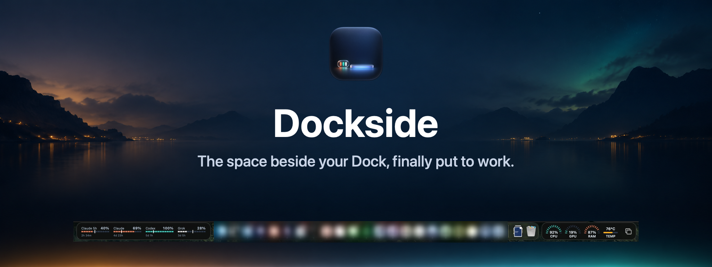
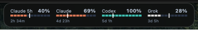
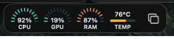
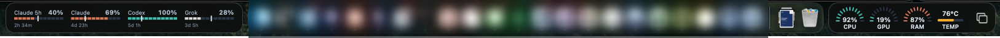

<p align="center">
  
</p>

# Dockside

**The empty space beside your Dock, put to work.**

On most Macs the space on either side of the Dock sits empty and forgotten. Dockside puts something useful there: a small glass bubble with your AI usage on the left, and a strip with live system stats on the right. Glance down, know where you stand, get back to work.

It is a native macOS app. No menu bar icon, no Dock icon, no windows to manage.

## What it shows

### AI usage



- **Claude** 5-hour and weekly usage, each with a pace line showing whether you are ahead or behind, and a countdown to reset.
- **Codex** and **Grok** usage from an optional feed you point it at (see below). Without a feed those meters are simply not shown.
- Hover for 0.3 seconds for details, such as "14% under pace".
- A reading that has gone stale turns gray instead of showing a number you can no longer trust.

### System stats



- CPU, GPU, and RAM gauges, plus CPU temperature.
- A Show desktop button at the outer end of the strip.
- Readings ease toward new values instead of jumping.
- Stats hide beside a side Dock; app buttons stay.

### Both, beside the Dock



## Features

- Sizes itself to the Dock and follows its position.
- Hides and shows with the Dock, including in full-screen apps.
- Three themes: **Glass**, **Pixel**, and **Rounded Ticks**. Right-click the bubble or strip and choose **Theme**.
- A compact layout kicks in automatically when the room beside the Dock gets tight.
- Respects light and dark appearance and Reduce Transparency.
- Opens at login. Right-click to turn that off or quit.

## Install

### Download

1. Get the latest DMG from [GitHub Releases](https://github.com/DHRlabs/dockside/releases/latest).
2. Open it and drag Dockside to Applications.
3. The app is not notarized, so the first launch needs right-click, then **Open**. Or open **System Settings > Privacy & Security** and choose **Open Anyway**.
4. Grant Accessibility when asked. Dockside needs it to find where the Dock is and how big it is.

### Build from source

Requirements: macOS 14 or later and the Xcode Command Line Tools.

```sh
git clone https://github.com/DHRlabs/dockside.git
cd dockside
bash Scripts/build.sh
cp -R build/Dockside.app /Applications/
```

To make a DMG yourself: `bash Scripts/package-dmg.sh <version>` writes `build/Dockside-<version>.dmg`.

## Requirements and notes

- **Claude meters** read the usage numbers the Claude desktop app already saves on your Mac. You need the Claude desktop app, and Homebrew `zstd` to decode them: `brew install zstd`.
- Dockside never asks for or reads keys, tokens, cookies, passwords, or keychain items. For Claude it reads only the saved usage numbers and nothing else from that app.
- CPU, GPU, and RAM come from system counters. Temperature uses CPU sensor keys verified on Apple M5; other hardware may show `--`.
- Accessibility is the only permission Dockside needs.

### Optional Codex and Grok feed

Point Dockside at a JSON feed you host:

```sh
defaults write com.dhrlabs.dockside UsageFeedURL "https://your-host/usage.json"
```

The URL must be http or https. Dockside picks it up within a minute. To turn the feed off, run `defaults delete com.dhrlabs.dockside UsageFeedURL`.

Dockside reads the feed once a minute. The shape it expects:

```json
{
  "accounts": [
    {
      "name": "Codex",
      "state": "ok",
      "at": "2026-01-01T12:00:00Z",
      "windows": [
        { "label": "5 hours", "used": 42, "resetsAt": "2026-01-01T15:00:00Z" },
        { "label": "week", "used": 17, "resetsAt": "2026-01-05T00:00:00Z" }
      ]
    },
    {
      "name": "Grok",
      "state": "ok",
      "at": "2026-01-01T12:00:00Z",
      "windows": [
        { "label": "week", "used": 8, "resetsAt": "2026-01-05T00:00:00Z" }
      ]
    }
  ]
}
```

- `name` is `Codex` or `Grok`. `state` must be `ok` for the reading to count.
- `at` is when the numbers were taken. `used` is a whole-number percent. `resetsAt` is when the window resets. Dates are ISO 8601.
- Codex uses the `5 hours` and `week` windows. Grok uses `week`.

## Buttons from other apps

Other apps can add buttons to the strip at the right end of the Dock. The wire contract is in [PROTOCOL.md](PROTOCOL.md).

## Development

```sh
bash Scripts/check-compact-layout.sh
```

checks compact-layout geometry.

## Credits and license

The pace math and the Claude desktop usage read are adapted from [Codenotch](https://github.com/vinzdg/codenotch) by vinzdg (MIT). The temperature reader and memory accounting are adapted from [Stats](https://github.com/exelban/stats) by Serhiy Mytrovtsiy (MIT). See [NOTICE](NOTICE) for details.

Dockside is licensed under the [MIT License](LICENSE).
